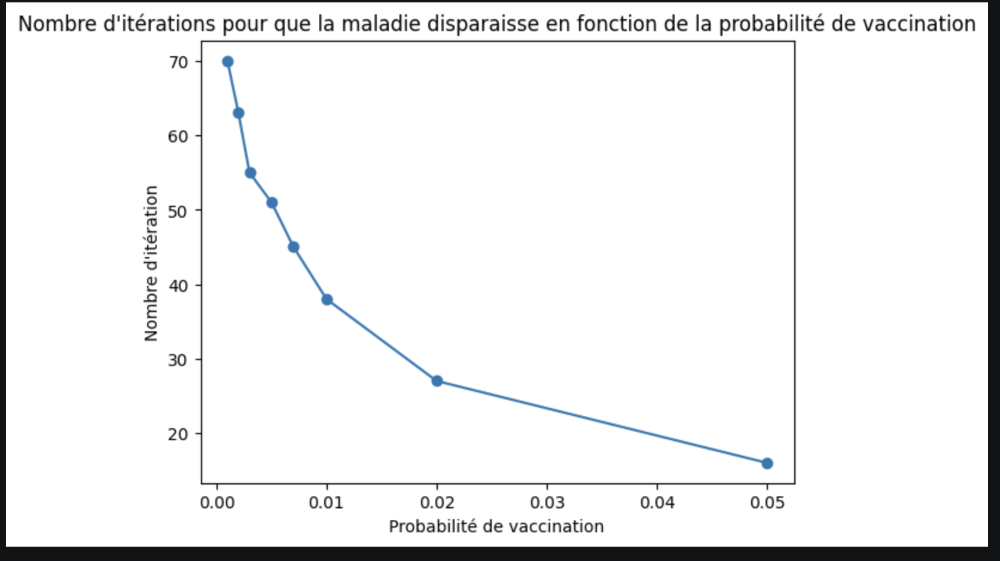
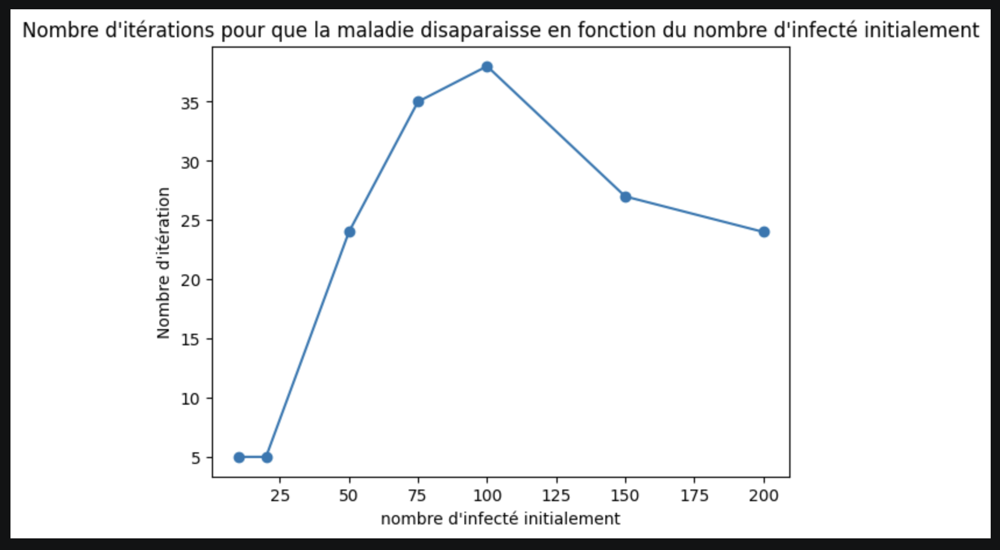

# Modeling Herd Immunity & Viral Propagation

Ce projet est une simulation de la propagation d'une maladie au sein d'une population dynamique utilisant un modèle d'automate cellulaire. L'objectif est d'étudier l'impact des politiques de vaccination et de l'immunité collective sur l'évolution d'une épidémie.

---

## Objectifs & Thèses

L'objectif est d'évaluer l'impact des paramètres de santé publique sur la cinétique épidémique.
*   **Thèse principale :** L'atteinte d'un seuil de vaccination (fixé ici à 50% selon les modèles théoriques) permet l'extinction de la maladie par immunité collective.
*   **Thèse secondaire :** Un réservoir infectieux initial trop important (50%+) entraîne une contamination quasi-instantanée de la population totale.

Le projet évalue l'efficacité des interventions de santé publique en faisant varier des paramètres tels que le taux de transmission, la durée d'incubation et la cinétique de vaccination.

---

## Architecture du Projet

Le simulateur est développé en Python en utilisant le paradigme de la Programmation Orientée Objet (POO).

*   **Modélisation spatiale :** La population est représentée par une matrice 2D où chaque cellule contient un objet `Individu`.
*   **Voisinage :** Utilisation du modèle de Moore (carré de 8 voisins).
*   **États des individus :**
    *  `Normal` : Susceptible d'être infecté.
    *  `Infecté` : Porteur et transmetteur de la maladie.
    *  `Immunisé` : Guéri après infection (protection temporaire).
    *  `Vacciné` : Protection permanente contre la maladie.

---

## Paramètres de Simulation

Le système est hautement configurable via les variables suivantes :
- **Taille de l'espace :** Dimensions de la matrice de simulation.
- **Taux de transmission :** Probabilité de contagion selon le nombre de voisins infectés (seuil par défaut : 3).
- **Durée de maladie :** Nombre d'itérations avant la guérison (défaut : 5).
- **Durée d'immunisation :** Temps pendant lequel un individu guéri ne peut pas être réinfecté.
- **Vaccination temps réel :** Probabilité pour un individu normal de se faire vacciner à chaque étape.

---

## Analyse des Résultats

Les simulations valident nos hypothèses sur la dynamique virale.

### 1. Impact du taux de vaccination
D'après nos tests, on observe une décroissance exponentielle de la durée de l'épidémie à mesure que la probabilité de vaccination augmente. 

*Note : Avec un taux de vaccination de 5%, la durée de présence du virus est divisée par 4 par rapport à une population non protégée.*

### 2. Dynamique du réservoir infectieux initial
L'analyse révèle un comportement non-linéaire du système.

*   **Croissance :** La persistance de la maladie augmente proportionnellement au nombre d'infectés jusqu'à un seuil critique (100 individus).
*   **Saturation :** Au-delà de ce seuil, la durée diminue : le virus sature si vite la population susceptible que l'épidémie s'éteint faute d'hôtes sains disponibles.

---
## Références & Inspirations
- **Modèles de complexité :** [Complexity Explorables](https://www.complexity-explorables.org/explorables/i-herd-you/)
- **Concepts épidémiologiques :** [Institut Pasteur - Immunité collective](https://www.pasteur.fr/fr/espace-presse/documents-presse/qu-est-ce-que-immunite-collective)
- **Données de santé :** [OMS (WHO) - COVID-19 & Herd Immunity](https://www.who.int/fr/news-room/questions-and-answers/item/herd-immunity-lockdowns-and-covid-19)

---
**Auteur :** Léonard Jung - Étudiant en Double Licence Mathématiques & Informatique à Sorbonne Université.
